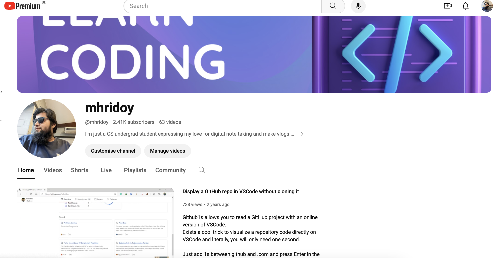

# CodeSage By Moshiur
## [www.codesagebymoshiur.org]
Welcome to CodeSage By Moshiur, an interactive platform designed to enhance your coding skills in Python and web development. This application offers an intuitive interface for learning Python, website design, and exploring the fascinating world of Robotics and IoT using Python Turtle Graphics.

## Features

- **Interactive Python Editor**: Write and execute Python code in real-time.
- **Python Turtle Graphics**: Learn and visualize coding concepts using Python Turtle.
- **Class Schedules**: Stay updated with our class schedules and course offerings.
- **Elegant and User-Friendly Design**: A soothing and attractive interface for an enjoyable learning experience.

## How to Use

1. **Select Activity**: Choose between the Python Editor or Python Turtle Graphics from the dropdown menu.
2. **Python Editor**:
   - Write your Python code in the text area.
   - Click 'Run Code' to execute and view the output.
3. **Python Turtle Graphics**:
   - Check the 'Show/Hide Python Turtle Window' to interact with Turtle Graphics.
   - Visit the provided Trinket.io link for more complex projects.

## Class Schedules

Our class schedules are designed to cater to various learning paces and styles:

| Batch  | Time        | Course              |
| ------ | ----------- | ------------------- |
| Batch1 | 10:00 AM    | Python              |
| Batch2 | 11:30 AM    | Python              |
| ...    | ...         | ...                 |

_Schedule is subject to changes. Please refer to our official website for the most current information._

## Collaborations

Proudly collaborating with **Dreamers Academy** to bring the best learning experience.

## Explore Our YouTube Channel

For more interactive tutorials and resources, visit our [YouTube channel](https://youtube.com/mhridoy).

## Contact Us

Have questions or suggestions? Reach out to us at [info@codesagebymoshiur.org](mailto:info@codesagebymoshiur.org).

## Footer

© 2023 CodeSage By Moshiur. All Rights Reserved.

